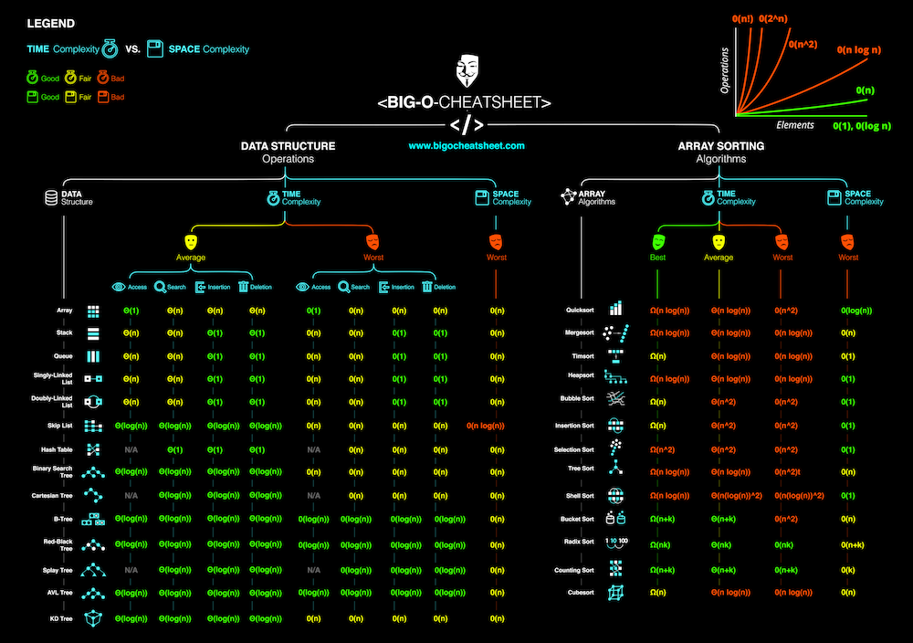

# dsa-python
Python is a high-level, general-purpose, and very popular programming language. Python programming language (latest Python 3) is being used in web development, Machine Learning applications, along with all cutting-edge technology in Software Industry.
> https://www.geeksforgeeks.org/introduction-to-python/
### Code References
[Hello_World.py](Hello_World.py)
## Big O
- O(n^2) : Loop within a Loop
- O(n) : Proportional
- O(log n) : Divide and Conquer
- O(1) : Constant
> 
https://www.bigocheatsheet.com/
### Code References
[Big_O_Linear.py](Big_O_Linear.py)<br>
[Big_O_Polynomial.py](Big_O_Polynomial.py)
## Classes & Objects
- Class : A class is a user-defined blueprint or prototype from which objects are created. Classes provide a means of bundling data and functionality together. Creating a new class creates a new type of object, allowing new instances of that type to be made.
    ```python
    class ClassName:
        # Statement
    ```    
- Object : An object is an instance of a class. A class is like a blueprint while an instance is a copy of the class with actual values.
    ```python
    obj = ClassName()
    ```
    An object consists of:<br>
    - **State/Attributes**: It is represented by the attributes of an object. It also reflects the properties of an object.
    - **Behavior/Methods**: It is represented by the methods of an object. It also reflects the response of an object to other objects.
    - **Identity**: It gives a unique name to an object and enables one object to interact with other objects.
- \_\_init__() method : It is a constructor used to initializing the object’s state. Like methods, a constructor also contains a collection of statements(i.e. instructions) that are executed at the time of Object creation. It runs as soon as an object of a class is instantiated. The method is useful to do any initialization you want to do with your object.
- \_\_str__() method : Python has a particular method called \_\_str__(). that is used to define how a class object should be represented as a string. It is often used to give an object a human-readable textual representation, which is helpful for logging, debugging, or showing users object information. When a class object is used to create a string using the built-in functions print() and str(), the \_\_str__() function is automatically used. You can alter how objects of a class are represented in strings by defining the \_\_str__() method.
### Code References
[Cookie.py](Cookie.py)
## Immutable vs Mutable Objects
- **Immutable** objects can’t be changed.<br>
int, float, bool, complex, tuple, frozenset, str
- **Mutable** objects can be changed.<br>
list, set, dict
## Simulating Pointers in Python
Just because pointers in Python don’t exist natively doesn’t mean you can’t get the benefits of using pointers.
1. **Using Mutable Types as Pointers**<br>
    Consider using a list and modifying the first element:
    ```python
    def add_one(x):
        x[0] += 1
    y = [2337]
    add_one(y)
    y[0] # 2338
    ```
    > This is only possible because list is a mutable type. If you tried to use a tuple, you would get an error:<br>
    TypeError: 'tuple' object does not support item assignment
    
    Another common approach to mimicking pointers in Python is to use a dict:
    ```python
    counters = {"func_calls": 0}
    def bar():
        counters["func_calls"] += 1
    def foo():
        counters["func_calls"] += 1
        bar()
    foo()
    counters["func_calls"] # 2
    ```
    > This is only possible because dict is a mutable type.<br>
    This only simulates pointer behavior and does not directly map to true pointers in C or C++. That is to say, these operations are more expensive than they would be in C or C++.
2. **Using Custom Python Objects**<br>
    The dict option is a great way to emulate pointers in Python, but sometimes it gets tedious to remember the key name you used. Creating a class is a great way to abstract the pesky details:
    ```python
    class Metrics(object):
        def __init__(self):
            self._metrics = {
                "func_calls": 0,
            }
        @property
        def func_calls(self):
            return self._metrics["func_calls"]
        def inc_func_calls(self):
            self._metrics["func_calls"] += 1
    metrics = Metrics()
    metrics.inc_func_calls()
    metrics.inc_func_calls()
    metrics.func_calls # 2
    ```
> For builtin ctypes module and more details visit https://realpython.com/pointers-in-python/